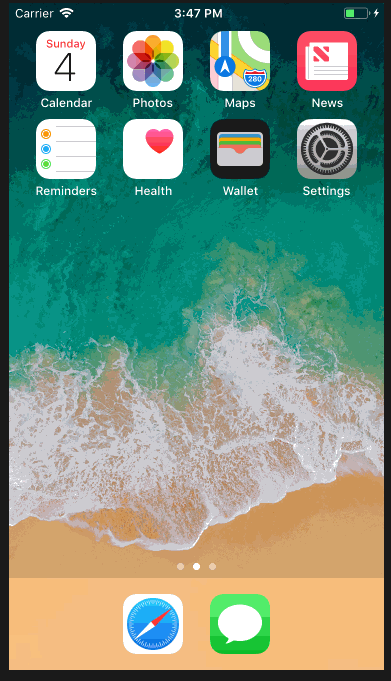
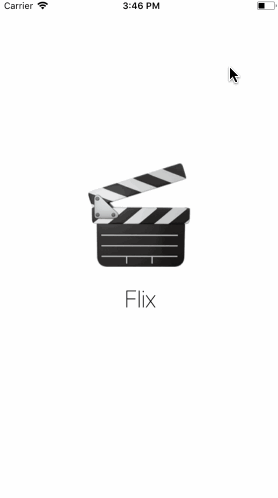
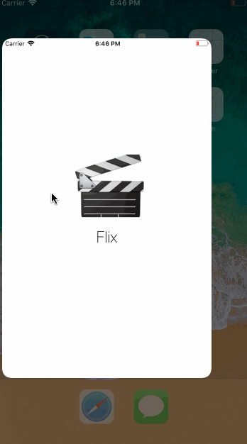

# Project 1 - Flix Part 1

Flix is a movies app using the [The Movie Database API](http://docs.themoviedb.apiary.io/#).

Time spent: 5 hours spent in total

## User Stories

The following **required** user stories are complete:

- [x] User sees app icon in home screen and styled launch screen (+1pt)
- [x] User can scroll through a list of movies currently playing in theaters from The Movie DB API (+5pt)
- [x] User can "Pull to refresh" the movie list (+2pt)
- [x] User sees a loading state while waiting for the movies to load (+2pt)

The following **stretch** user stories are implemented:

- [ ] User sees an alert when there's a networking error (+1pt)
- [ ] User can search for a movie (+3pt)
- [ ] While poster is being fetched, user see's a placeholder image (+1pt)
- [ ] User sees image transition for images coming from network, not when it is loaded from cache (+1pt)
- [ ] Customize the selection effect of the cell (+1pt)
- [ ] For the large poster, load the low resolution image first and then switch to the high resolution image when complete (+2pt)

The following **additional** user stories are implemented:

- [ ] List anything else that you can get done to improve the app functionality! (+1-3pts)

Please list two areas of the assignment you'd like to **discuss further with your peers** during the next class (examples include better ways to implement something, how to extend your app in certain ways, etc):

1. Buttons could be implemented to share a specific movie through social media or SMS/email
2. There could be a feature where the user can put the app in dark mode or light mode.

## Video Walkthrough

Here's a walkthrough of implemented user stories:

## Notes

Describe any challenges encountered while building the app.

- Had a problem getting the UITableViewCell height to scale properly.

# Project 2 - Flix Part 2

Flix is a movies app displaying box office and top rental DVDs using [The Movie Database API](http://docs.themoviedb.apiary.io/#).

Time spent: 3 hours spent in total

## User Stories

The following **required** functionality is completed:

- [x] User can tap a cell to see a detail view (+5pts)
- [x] User can tap a tab bar button to view a grid layout of Movie Posters using a CollectionView (+5pts)

The following **stretch** features are implemented:

- [x] User can tap a poster in the collection view to see a detail screen of that movie (+3pts)
- [ ] In the detail view, when the user taps the poster, a new screen is presented modally where they can view the trailer (+3pts)
- [ ] Customize the navigation bar (+1pt)
- [ ] List in any optionals you didn't finish from last week (+1-3pts)
   - ...
   - ...

The following **additional** features are implemented:

- [x] List anything else that you can get done to improve the app functionality!

Please list two areas of the assignment you'd like to **discuss further with your peers** during the next class (examples include better ways to implement something, how to extend your app in certain ways, etc):

1. There could be a toggle at the top of the screen for the user to choose how many movies should be in each column in case they cant see as well.
2. A feature that could be implemented is the ability to select genre of movie from a dropdown for the grid view.

## Video Walkthrough

Here's a walkthrough of implemented user stories:

## Notes

Describe any challenges encountered while building the app.

# Lab 3 - Flix

Flix is a movies app displaying box office and top rental DVDs using [The Movie Database API](http://docs.themoviedb.apiary.io/#).

Time spent: 5 hours spent in total

## User Stories

The following **required** user stories are complete:

- The following screens use AutoLayout to adapt to various orientations and screen sizes
- [x] Movie feed view (+3pt)
- [x] Detail view (+2pt)

The following **stretch** user stories are implemented:

- [x] Dynamic Height Cells (+1)
- [ ] Collection View AutoLayout (+2)

The following **additional** user stories are implemented:

- [x] List anything else that you can get done to improve the app functionality! (+1-3pts)

Please list two areas of the assignment you'd like to **discuss further with your peers** during the next class (examples include better ways to implement something, how to extend your app in certain ways, etc):

1. Aligning label text to top by default
2. When to use clip to bounds vs when not to.

## Video Walkthrough

Here's a walkthrough of implemented user stories:

## Notes

Describe any challenges encountered while building the app.

# Lab 5 - Flix

Flix is a movies app displaying box office and top rental DVDs using [The Movie Database API](http://docs.themoviedb.apiary.io/#).

Time spent: 3 hours spent in total

## User Stories

The following **required** user stories are complete:

- [x] Create a movie model (+2pt)
- [x] Implement the movie model (+2pt)
- [x] Implement property observers (+2pt)
- [x] Create a basic API Client (+2pt)

The following **additional** user stories are implemented:

- [x] List anything else that you can get done to improve the app functionality! (+1-3pts)

Please list two areas of the assignment you'd like to **discuss further with your peers** during the next class (examples include better ways to implement something, how to extend your app in certain ways, etc):

1. A button that toggles the view between now playing movies and popular movies.

## Video Walkthrough

Here's a walkthrough of implemented user stories:

GIF created with [LiceCap](http://www.cockos.com/licecap/).

## Notes

Describe any challenges encountered while building the app.

## License

    Copyright 2018 Kode Williams

    Licensed under the Apache License, Version 2.0 (the "License");
    you may not use this file except in compliance with the License.
    You may obtain a copy of the License at

        http://www.apache.org/licenses/LICENSE-2.0

    Unless required by applicable law or agreed to in writing, software
    distributed under the License is distributed on an "AS IS" BASIS,
    WITHOUT WARRANTIES OR CONDITIONS OF ANY KIND, either express or implied.
    See the License for the specific language governing permissions and
    limitations under the License.
    
    
