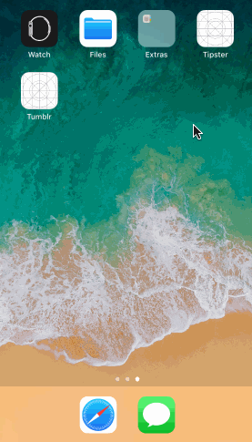
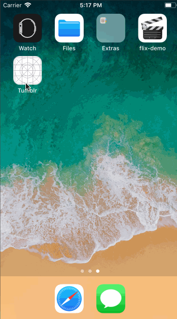

# Lab 1 - Tumblr

Tumblr is a photo browsing app using the [The Tumblr API](https://www.tumblr.com/docs/en/api/v2#posts).

Time spent: 2 hours spent in total

## User Stories

The following **required** user stories are complete:

- [x] User can scroll through a feed of images returned from the Tumblr API (5pts)

The following **stretch** user stories are implemented:

- [ ] User sees an alert when there's a networking error (+1pt)
- [ ] While poster is being fetched, user see's a placeholder image (+1pt)
- [ ] User sees image transition for images coming from network, not when it is loaded from cache (+1pt)
- [ ] Customize the selection effect of the cell (+1pt)

The following **additional** user stories are implemented:

- [x] List anything else that you can get done to improve the app functionality! (+1-3pts)

Please list two areas of the assignment you'd like to **discuss further with your peers** during the next class (examples include better ways to implement something, how to extend your app in certain ways, etc):

1. The app could have the images displayed in cards so they can be more easily distincted
2. There could be lazy loading for the images so as to make the app more efficient

## Video Walkthrough

Here's a walkthrough of implemented user stories:

## Notes

Describe any challenges encountered while building the app.

- One challenge was getting the images to load and scale properly due to unstable network connection

# Lab 2 - Tumblr

Tumblr is a photo browsing app app using the [The Tumblr API](https://www.tumblr.com/docs/en/api/v2#posts).

Time spent: 1 hours spent in total

## User Stories

The following **required** user stories are complete:

- [x] User can tab an image to view a larger image in a detail view (5pts)

The following **stretch** user stories are implemented:

- [x] Add Avatar and Publish Dates (+2pt)
- [ ] Zoomable Photo View (+2pt)
- [ ] Infinite Scrolling (+2pt)

The following **additional** user stories are implemented:

- [x] List anything else that you can get done to improve the app functionality! (+1-3pts)

Please list two areas of the assignment you'd like to **discuss further with your peers** during the next class (examples include better ways to implement something, how to extend your app in certain ways, etc):

1. A possible page where you could tap on the publish date  and all the pictures published on that day are shown in a view.
2. Best practice for implementing the zoom feature.

## Video Walkthrough

Here's a walkthrough of implemented user stories:

## Notes

Describe any challenges encountered while building the app.
1. The images refused to stretch to the corners of the screen (until I learned about contraints).
2. I was successful in extracting the post date and avatar image URL from the network request data, but the image kept stretching and covering them even after layout in storyboard.

## License

Copyright 2018 Kode Williams

Licensed under the Apache License, Version 2.0 (the "License");
you may not use this file except in compliance with the License.
You may obtain a copy of the License at

http://www.apache.org/licenses/LICENSE-2.0

Unless required by applicable law or agreed to in writing, software
distributed under the License is distributed on an "AS IS" BASIS,
WITHOUT WARRANTIES OR CONDITIONS OF ANY KIND, either express or implied.
See the License for the specific language governing permissions and
limitations under the License.
